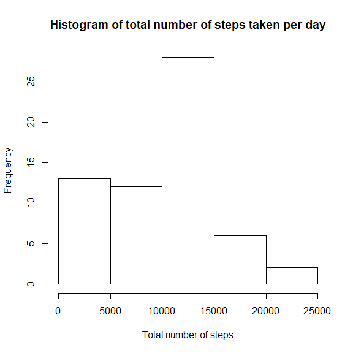
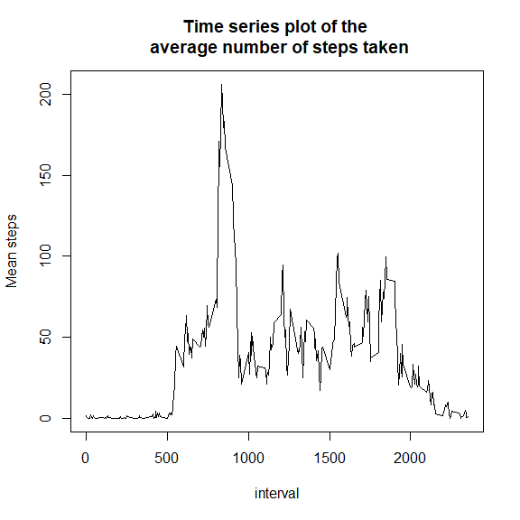
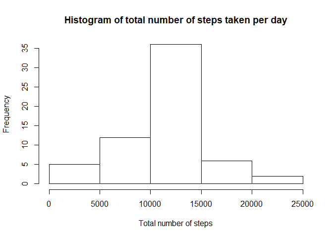
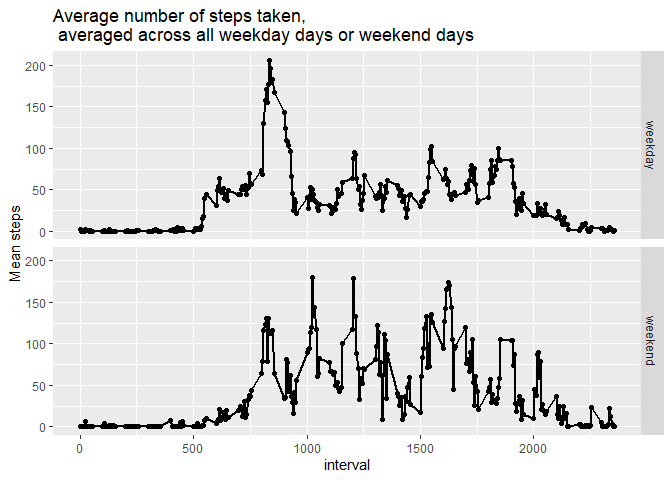

Reproducible Research: Peer Assessment 1
========================================

Loading and preprocessing the data
----------------------------------

``` r
dt <- read.csv("activity.csv", header = T)
```

What is mean total number of steps taken per day?
-------------------------------------------------

1.  Calculate the total number of steps taken per day

``` r
dt1 <- dt[!is.na(dt$steps),]

total_number_steps <- with(dt, tapply(steps, as.factor(dt$date), sum, na.rm = T))
```

1.  If you do not understand the difference between a histogram and a
    barplot, research the difference between them. Make a histogram of
    the total number of steps taken each day

``` r
hist(total_number_steps, main = "Histogram of total number of steps taken per day", xlab = "Total number of steps")
```



1.  Calculate and report the mean and median of the total number of
    steps taken per day

``` r
stepsByDayMean <- mean(total_number_steps)
stepsByDayMedian <- median(total_number_steps)
```

-   Mean: 9354.2295082
-   Median: 10395

What is the average daily activity pattern?
-------------------------------------------

1.  Make a time series plot (i.e. type = “l”) of the 5-minute interval
    (x-axis) and the average number of steps taken, averaged across all
    days (y-axis)

``` r
mean_steps <- with(dt1, tapply(steps, dt1$interval, mean))
interval <- levels(as.factor(dt1$interval))
plot(interval, mean_steps, type = "l", main = "Time series plot of the \n average number of steps taken", xlab = "interval", ylab = "Mean steps")
```



1.  Which 5-minute interval, on average across all the days in the
    dataset, contains the maximum number of steps?

``` r
table <- data.frame(mean_steps, interval)
table[table$mean_steps==max(table$mean_steps),][2]
```

    ##     interval
    ## 835      835

Imputing missing values
-----------------------

1.  Calculate and report the total number of missing values in the
    dataset (i.e. the total number of rows with NA)

``` r
missing_dt <- dt[is.na(dt$steps),]
length(missing_dt$steps)
```

    ## [1] 2304

1.  Devise a strategy for filling in all of the missing values in the
    dataset. The strategy does not need to be sophisticated. For
    example, you could use the mean/median for that day, or the mean for
    that 5-minute interval, etc.

``` r
# Replacing the missing values by the the average number of steps taken, averaged across all days.
mean_steps <- with(dt1, tapply(steps, dt1$interval, mean))
missing_dt$steps <- mean_steps
```

1.  Create a new dataset that is equal to the original dataset but with
    the missing data filled in.

``` r
new_dt <- rbind(dt1, missing_dt)
new_dt <- new_dt[order(new_dt$date), ]
```

1.  Make a histogram of the total number of steps taken each day and
    Calculate and report the mean and median total number of steps taken
    per day. Do these values differ from the estimates from the first
    part of the assignment? What is the impact of imputing missing data
    on the estimates of the total daily number of steps?

``` r
total_number_steps2 <- with(new_dt, tapply(steps, as.factor(new_dt$date), sum))

hist(total_number_steps2, main = "Histogram of total number of steps taken per day", xlab = "Total number of steps")
```



``` r
stepsByDayMeanImputed <- mean(total_number_steps2)
stepsByDayMedianImputed <- median(total_number_steps2)
```

Mean and median total number of steps taken per day WITHOUT filling in
the missing values

-   Mean: 9354.2295082
-   Median: 10395

Mean and median total number of steps taken per day WITH filling in the
missing values

-   Mean: 10766.18868
-   Median: 10766.18868

Are there differences in activity patterns between weekdays and weekends?
-------------------------------------------------------------------------

1.  Create a new factor variable in the dataset with two levels –
    “weekday” and “weekend” indicating whether a given date is a weekday
    or weekend day.

``` r
new_dt$days <- weekdays(as.Date(new_dt$date))
# find weekend features in the dataset
weekend_feature <- grep("Sabado|Domingo", new_dt$days, ignore.case = T)
# subset data of the weekend
weekend_dt<-  new_dt[weekend_feature, ]
weekend_dt$weekday <- "weekend"

# subset data of the weekday
weekday_dt <- subset(new_dt,new_dt$days!=weekend_feature)
```

    ## Warning in new_dt$days != weekend_feature: longitud de objeto mayor no es
    ## múltiplo de la longitud de uno menor

``` r
weekday_dt$weekday <- "weekday"

# create a new dataset containing 2 new variable "days" and weekday" 
# - days: indicates the days in the week
# - weekday: indicate the days are at the "weekend" or "weekday"
new_dt2 <- rbind(weekday_dt, weekend_dt)
```

1.  Make a panel plot containing a time series plot (i.e. type = “l”) of
    the 5-minute interval (x-axis) and the average number of steps
    taken, averaged across all weekday days or weekend days (y-axis).
    See the README file in the GitHub repository to see an example of
    what this plot should look like using simulated data.

``` r
mean_number_steps <- aggregate(steps~ interval+weekday, new_dt2, mean)
g <- qplot(interval, steps, data = mean_number_steps, facets = weekday~.)
g + geom_line(size = 1) + ylab("Mean steps") + ggtitle("Average number of steps taken, \n averaged across all weekday days or weekend days ")
```


